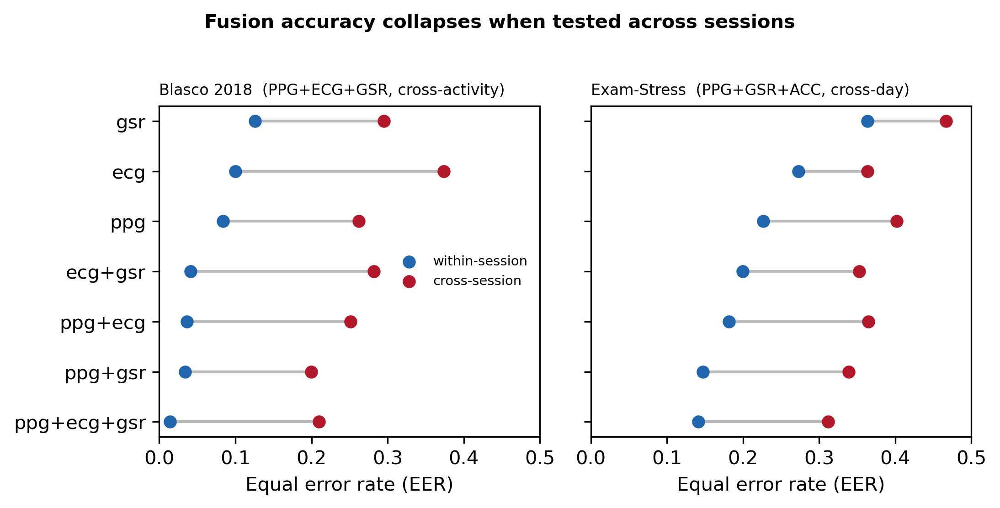
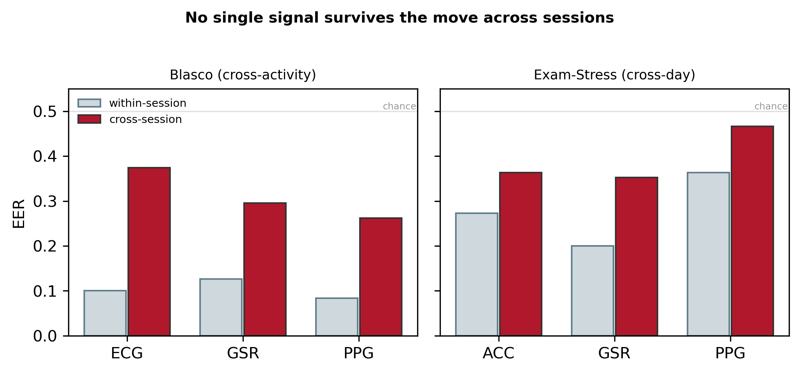
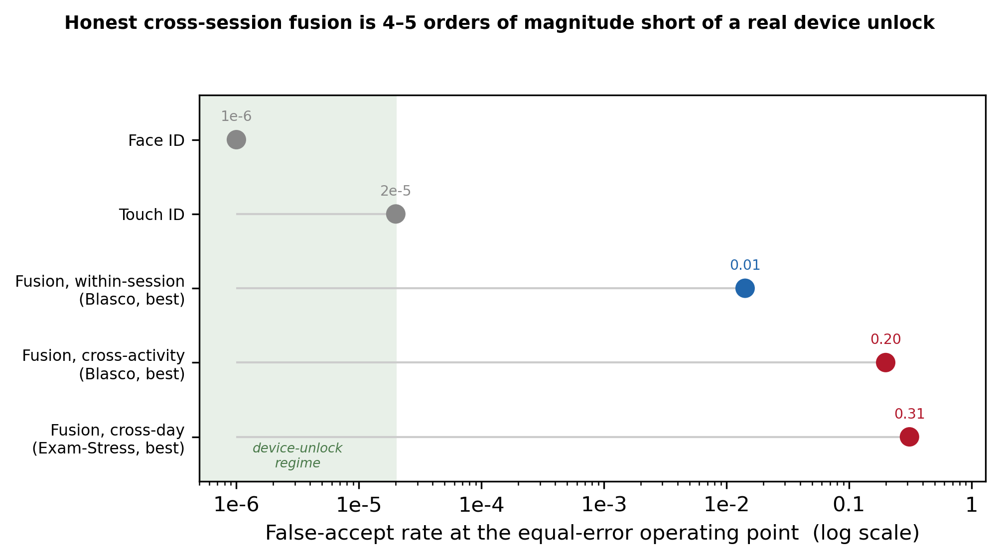

# When does wearable multi-signal fusion stop working?
### A cross-session benchmark for fast biometric authentication

**Noor Abdalla** · Independent researcher
Code: https://github.com/noorabdalla04/wearable-fusion-auth-benchmark

> This is the GitHub-readable version of the paper. The typeset PDF (`main.pdf`) is
> built from `main.tex` + `refs.bib`. All numbers are produced by `reproduce.py`.

## Abstract

Consumer wearables can read several physiological signals at once — photoplethysmography
(PPG), electrocardiography (ECG), electrodermal activity (GSR) and accelerometry (ACC) — and
a recurring proposal is to fuse them into a fast "your body is your password" unlock: glance
at the watch, get identified in seconds, like a fingerprint. Published fusion systems report
near-perfect accuracy (equal error rates around 2%), which makes the idea look solved. We show
that this number is an artefact of evaluating enrolment and test data from the **same recording
session**. We build an open, data-source-agnostic benchmark that (i) reproduces the flattering
within-session number on a public multi-signal dataset (Blasco et al. 2018; full-fusion
EER 0.014, matching the reported ~0.02), and then (ii) re-evaluates the identical pipeline
across sessions using two protocols: a cross-activity proxy on the same day, and a genuine
cross-day protocol on a second dataset (PhysioNet Exam-Stress; three exams on different days).
Accuracy collapses: the best honest cross-session EER is 0.199 (cross-activity) and 0.312
(cross-day) — a 14× and 2.2× degradation. Signal fusion gives a small, real edge over the best
single signal (+0.04 to +0.06 EER) but does not close the gap, and the cardiac signal — the
component an unlock would most rely on — degrades most across sessions, dropping out of the
cross-session optimum entirely. Translated to a security operating point, the best honest
cross-session fusion is ~10,000–16,000× more permissive than Touch ID and ~200,000–312,000×
more permissive than Face ID. We conclude that fast wearable fusion is not a device-unlock
primitive; its honest role is a low-stakes "probably still the same wearer" continuity check.
All code, loaders, and a one-command reproduction are released.

## 1. Introduction

Every modern smartwatch carries an optical pulse sensor, an accelerometer, and increasingly an
electrodermal or single-lead ECG sensor. A long line of work asks whether these signals can
**identify** the wearer, and the most attractive framing is authentication: use the body's own
signals as a password, so a device unlocks the moment it is worn. The literature appears to
support it, with multi-signal fusion reporting equal error rates (EERs) around 2% or better.

There is a catch that is easy to miss and decisive in practice. Most flattering numbers split
a **single recording session** into enrolment and test partitions. Within one session a
classifier can lock onto session-specific nuisance structure — sensor placement, contact
pressure, skin state — that is perfectly predictive *within that session* but has nothing to
do with stable identity. A real unlock must work tomorrow, on a freshly donned device. The
scientific question is therefore not "can we separate people within a session" (we can, easily)
but "does that separation survive a change of session."

**Contributions:** (1) an open, data-source-agnostic benchmark (common schema + thin per-dataset
loaders + one leakage-audited pipeline); (2) a faithful reproduction of the flattering
within-session number (EER 0.014 on Blasco, matching ~0.02); (3) a cross-session evaluation
under a same-day cross-activity proxy and a true cross-day protocol, quantifying a 14× / 2.2×
collapse; (4) a fusion verdict and security-bar accounting showing the honest operating point
is 4–5 orders of magnitude short of Touch ID / Face ID. This is a negative result with a
constructive framing: we measure precisely where a widely-assumed idea fails, and release the
tooling so the measurement is cheap to repeat.

## 2. Related work

**Physiological biometrics.** PPG and ECG have both been studied as biometric traits, with
within-session accuracies frequently in the high-90s percent. Fusion of cardiac signals with
other modalities is a recurring theme.

**The permanence problem.** That intuition is rarely tested across time. Permanence — stability
across sessions and days — is a named property in biometrics, and several wrist-PPG studies that
test it report large cross-day degradation. The dataset we anchor on states its own limitation
plainly: its signals "were acquired only once on a given day," and it recommends "cross-day and
long-term analysis" as future work. This study is in part that recommended follow-up, extended
to fusion and to a security-bar comparison.

**Where this sits.** We do not claim that fusing wearable signals to identify a person is new.
What is under-served is a *disciplined, reproducible, cross-session-honest* benchmark that
reproduces the optimistic within-session number with the same pipeline it then stress-tests,
reports cross-session numbers with leakage controls and confidence intervals, and states the
security implication in practitioner units.

## 3. Methods

### 3.1 Datasets

| Dataset | Subjects | Sessions | Signals | Rate | Cross-session axis |
|---|---|---|---|---|---|
| Blasco 2018 | 25 | 3 activities (1 day) | PPG, ECG, GSR | 100 Hz | cross-activity (proxy) |
| Exam-Stress | 10 | 3 exams (different days) | PPG, ACC, GSR | 64 Hz† | cross-day (true) |

**Blasco 2018.** 25 subjects (ages 18–42, mean 28.1; 16 M, 9 F), three activity states on a
single day (seated rest; walking; seated after a stroll). PPG/ECG/GSR at 100 Hz. There is **no
usable accelerometer** in the released files, so Blasco fusion is PPG+ECG+GSR. Because all
recordings are from one day, its cross-"session" axis is really **cross-activity** — a proxy.

**PhysioNet Exam-Stress.** Empatica E4 wrist device, 10 subjects, three exams on **different
days**. BVP (PPG) 64 Hz, 3-axis ACC 32 Hz, EDA (GSR) 4 Hz; **no ECG**. Fusion is PPG+ACC+GSR;
cross-session axis is a genuine **cross-day** test. Recordings span 3–7 h.
† Channels have different native rates; the loader resamples all onto a shared 64 Hz grid.

Together the two datasets cover all four signals and provide both a same-day proxy and a true
cross-day protocol.

### 3.2 Common schema
A single `Recording` type holds {subject id, session id, condition, sampling rate, dict of
equal-length time-aligned channels} with canonical channel names. Each dataset has a thin
loader; no downstream code knows which dataset it is processing. This let us add a second
dataset (different device, signals, rates) with **zero** change to the processing, feature,
evaluation, or analysis code. `session_id` is the split axis.

### 3.3 Signal processing & windowing
Standard cleaning (NeuroKit2 for PPG/ECG; 5 Hz low-pass for GSR; ACC as vector magnitude).
Non-overlapping **5-second windows** — the fast "glance-and-go" regime. Per-window quality
flags mark bad channels; a window is kept if ≥1 cardiac channel is good, with per-channel "ok"
flags for per-combination filtering.

### 3.4 Features
Signal-shape features only, never identity/recording tokens: cardiac HR/variability and pulse
morphology, spectral band energy, distributional shape; GSR level/spread/slope; ACC
level/spread/band energy. 26 features per dataset.

### 3.5 Leakage audit
Automated audit rejects identity-like names (token-boundary), confirms window index is never a
feature, flags degenerate features, and red-flags implausible single-feature separability.
Passes on both datasets. End-to-end control: within-session label permutation must score at
chance — it does (§4.6).

### 3.6 Evaluation
Closed-set verification; report EER and ROC AUC. Scorer = per-window RandomForest subject
classifier (200 trees); verification score = P(claimed subject). We use a supervised classifier
because that is the model class that produces the flattering literature numbers (a distance
template gives within-session EER ≈ 0.17 and does not reproduce them). Standardisation fit on
enrolment only.
- **Within-session:** enrol/test on disjoint window partitions of the same session (runtime
  disjointness assertion), averaged over sessions.
- **Cross-session:** enrol on one session, test on a different one (common subjects), averaged
  over ordered session pairs. Blasco = cross-activity; Exam-Stress = cross-day.

All randomness seeded; the whole pipeline regenerates via `reproduce.py`.

## 4. Results

### 4.1 The flattering within-session number reproduces
On Blasco, full-fusion within-session verification reaches **EER 0.014**, matching the ~0.02
reported by Blasco et al. Our pipeline achieves the optimistic number that motivates the
"body-as-password" premise. Every single signal is individually usable within session
(EER 0.084–0.126).

### 4.2 Accuracy collapses across sessions

| Dataset | Signals | Within EER | Cross EER | Collapse |
|---|---|---|---|---|
| Blasco 2018 | PPG+ECG+GSR | **0.014** | 0.199–0.210 | ~14× |
| Exam-Stress | PPG+GSR+ACC | 0.141–0.147 | 0.312–0.339 | ~2.2× |

On Blasco the best cross-activity EER is 0.199 (14× degradation). On Exam-Stress — the true
cross-day test — the best cross-day EER is 0.312 (2.2× degradation, from a within-session
baseline that is itself weaker because multi-hour wrist BVP is far noisier). At these operating
points the system is close to a coin flip at any usable threshold.

### 4.3 Does fusion survive? A small edge, not a rescue
Fusion's cross-session advantage over the best single signal is real but small: +0.062 EER
(Blasco), +0.041 (Exam-Stress). It does not close the gap — absolute cross-session EER stays
0.20–0.34. The full-fusion triple is never the cross-session optimum: the best combination is
PPG+GSR on Blasco (ECG drops out) and GSR+ACC on Exam-Stress (PPG drops out) — in each dataset
a **cardiac channel is discarded** because its within-session identity content does not transfer.

No single signal survives the move across sessions. On the wrist device (Exam-Stress) the
cardiac PPG — the signal a consumer unlock would most naturally rely on — is the single least
stable across days and is dropped from the optimum entirely.

### 4.4 Security-bar accounting
At the equal-error operating point, false-accept rate = EER. Against Touch ID
(FAR ≈ 2×10⁻⁵, ~1 in 50,000) and Face ID (FAR ≈ 1×10⁻⁶, ~1 in 1,000,000):

| Operating point | Combination | FAR (=EER) | vs Touch ID | vs Face ID |
|---|---|---|---|---|
| Blasco cross-activity | PPG+GSR | 0.199 | ~9,970× | ~199,400× |
| Exam-Stress cross-day | GSR+ACC | 0.312 | ~15,595× | ~311,900× |

The best honest cross-session fusion is 4–5 orders of magnitude short of a real device unlock.

### 4.6 Robustness and honesty checks
- **Label-shuffle:** permuting subject labels within session drives both within and cross EER
  to chance (0.50/0.50) — real performance is genuine signal, not leakage.
- **Window length:** Blasco features at 3/5/10 s keep within EER 0.014–0.020 and cross ~0.21 —
  the collapse is not a windowing artefact.
- **Bootstrap CIs:** within vs cross 95% CIs are cleanly non-overlapping (Blasco within
  [0.006, 0.026] vs cross [0.119, 0.297]; Exam-Stress within [0.134, 0.157] vs cross
  [0.295, 0.377]).

## 5. Discussion

**What the number means.** The within-session ~2% EER is real but answers the wrong question.
A password lives in the cross-session regime, where the honest number is 0.20–0.34 EER —
unusable as an unlock.

**Why fusion does not save it.** Fusion gives a small real gain, dwarfed by the cross-session
collapse; the cardiac signal an unlock would lean on is the least stable. Fusion cannot rescue
signals that individually fail to transfer.

**The honest use case.** A fast fused read cannot be a device unlock, but it can be a low-stakes
**continuity** check — "is this probably still the same wearer" — where a 20% error rate is
tolerable because the fallback is benign. Presenting the same technology as a fingerprint
replacement is the error we forestall.

**Limitations.** (1) Blasco's cross axis is cross-activity on one day, a proxy; the true
cross-day result (Exam-Stress) is worse. (2) The two datasets' absolute EERs are not directly
comparable — we compare the within→cross collapse within each. (3) Cross-day, the residual is
carried by GSR/ACC, which may encode behavioural/postural habit or per-session stress baseline
rather than stable identity; we do not claim the residual is "identity." (4) Both datasets are
small (n=25, n=10); direction is robust to our controls, but magnitudes on larger populations
remain to be measured — which the released benchmark enables.

## 6. Conclusion
Fast multi-signal wearable fusion reproduces near-perfect within-session authentication and
then fails across sessions by 2–14×, landing 4–5 orders of magnitude short of a real device
unlock. Fusion helps a little and does not close the gap; the cardiac signal degrades most. We
release a reproducible, leakage-audited, cross-session-honest benchmark and a one-command
reproduction.

## Reproducibility & data availability
All code, loaders, leakage audit, evaluation harness, and `reproduce.py` are at
https://github.com/noorabdalla04/wearable-fusion-auth-benchmark. Raw datasets come from their
original sources under their own licenses (Blasco 2018, DOI 10.3390/s18092782; PhysioNet
Exam-Stress, ODC-By); the repo never redistributes raw data and documents provenance and
checksums. Results were produced with a fixed random seed.

## References
- Blasco, J. & Peris-Lopez, P. (2018). *On the Feasibility of Low-Cost Wearable Sensors for
  Multi-Modal Biometric Verification.* Sensors 18(9), 2782. doi:10.3390/s18092782
- *A Wearable Exam Stress Dataset for Predicting Cognitive Performance in Real-World Settings.*
  PhysioNet v1.0.0 (ODC-By). https://physionet.org/content/wearable-exam-stress/1.0.0/
